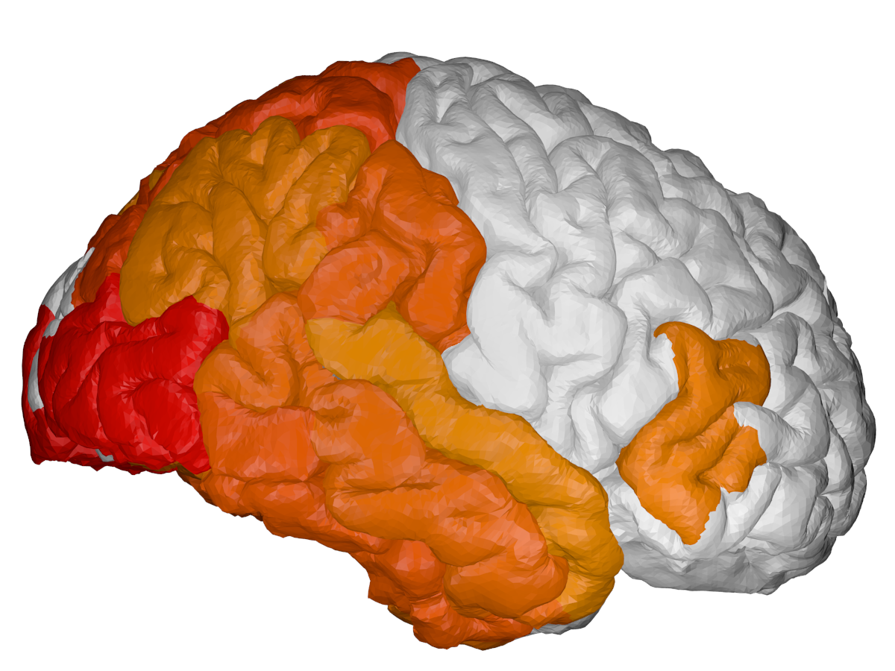

# INPUT: 
### csv file with pathology numbers in user-defined range (0-3 here) 

. |  hippocampus [0-3] | inferior temporal [0-3] | superior parietal [0-3] | ...
:-------------:|:-----:|:---:|:---:|:---:|
Pathology in Image 1| 0.6 | 2.3 | 1.3 | ..
Pathology in Image 2| 1.2 | 0.0 | 3.0 | ..
Pathology in Image 3| 2.4 | 0.1 | 1.6 | ..


# OUTPUT: 
### cortical + subcortical drawings for each table row:

Cortical surface           |  Subcortical structures
:-------------------------:|:-------------------------:
  |   

# Brain colouring software 
Author: Razvan V. Marinescu - razvan@csail.mit.edu

I plan to publish a paper on this, which can be cited. Until then, I would appreciate if you could include me as a co-author.

License: CC-BY 3.0

# Installation using Docker

In order to remove the need to install blender and it's dependencies, I made a container which has blender and this repository already pre-installed and ready to run.

1. Install Docker for your current operating system. For MacOS use this link:
https://docs.docker.com/v17.12/docker-for-mac/install/#download-docker-for-mac

    Make sure you run the docker deamon after installing. To check if it installer properly, run:
    
    ``` docker info```
    
    If prompted to make an account with dockerhub, skip as you don't need one.

2. Download the docker image with the bundled blender and brain coloring software using:
     ``` docker run -it mrazvan22/brain-coloring ```
    
    The image size may be large (~1GB), so use a good connection. Note that after the download, it will automatically connect to the container. If it connected successfully, you should see the shell as follows:
    
    ``` root@e3b175e886db:/# ```

3. Go to the directory and run the make command

    ``` cd /home/brain-coloring/ ```
    
    ``` make ```
    
If successful, you should see the images in output/pcaCover being updated. 

# Installation without Docker

Note that this is harder due to the need of installing packages in the python version bundled with blender. 

1. Install blender

2. Pull the git repository: 

    ```git clone https://github.com/mrazvan22/brain-coloring```

3. Go to the directory and run the make command

    ``` cd brain-coloring/ ```

    ``` make ```

    If successful, you should see blender loading the structures and updating the images in output/pcaCover. 

4. If running on MacOS, blender might not be added to your path. In this case, run (change the path/to/blender to your installation location):

    ``` sudo /Applications/Blender/blender.app/Contents/MacOS/blender --background --python blendCreateSnapshot.py ```

5. If python libraries are missing, install them using: 

    ``` pip3 install scipy ```
    ``` pip3 install numpy ```

    If the same error is obtained even after installing, it's probably because the packages are installed in the default system-wide python instead of the local python. See this answer for how to fix this:
    
    https://blender.stackexchange.com/questions/5287/using-3rd-party-python-modules
    
    Note: do not install the bpy package, as it comes automatically with the blender-bundled python

# Running the software

1. Generate the list of pathology numbers according to the format in data/pcaCover.csv. Each row will generate a pair of cortical/subcortical images.

1.1 If using docker, copy your input.csv representing pathology values to the docker container 

    ``` sudo docker cp input.csv 9f52258c25f6:/home/brain-coloring/data```

    Here, replace 9f52258c25f6 with your container-ID, which you can find by running on host:

    ``` 
    docker ps 
    
    CONTAINER ID        IMAGE                      COMMAND     
    e3b175e886db        mrazvan22/brain-coloring   "/bin/bash"
    ```

2. change configuration file config.py
	- input file: set to your new input file
	- brain type: pial or inflated
	- image type: cortical or subcortical
	- RGB colours to show pathology
	- the mapping between your atlas and the 3D brain regions that will be coloured (we use the DK atlas)
	- image resolution, etc ...
	
3. re-generate images using the Makefile command
	
	``` make ```

3.1. If using docker, copy the image out of the docker container to the home directory ~/ :

    ``` sudo docker cp <yourContainerID>:/home/brain-coloring/output/pcaCover/cortical_0.png ~/ ```

