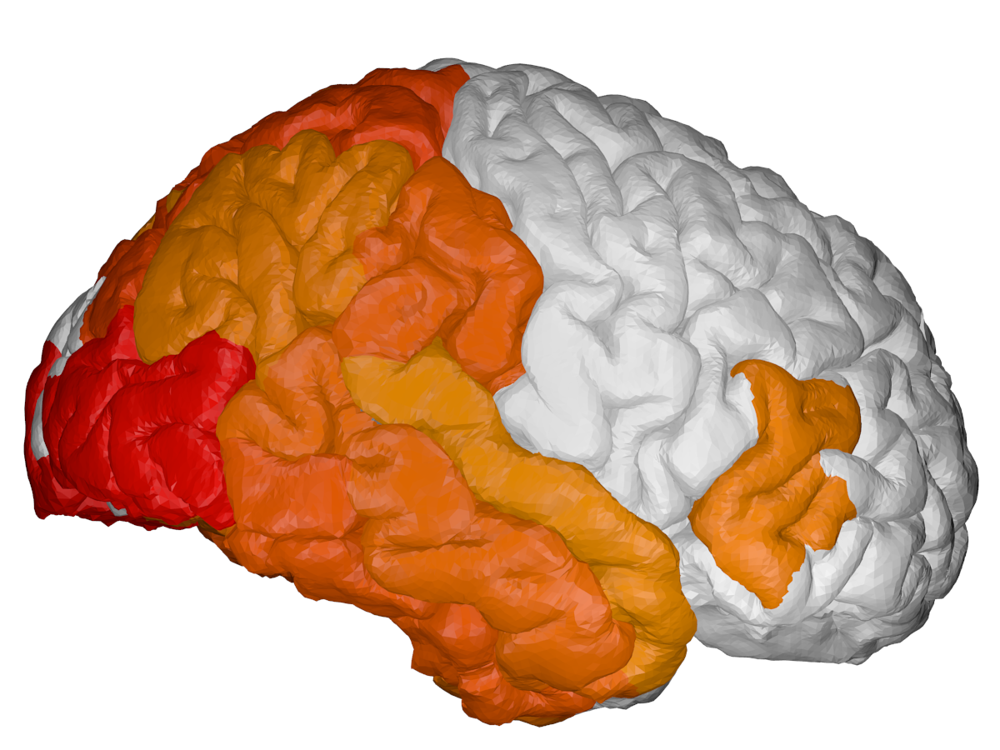
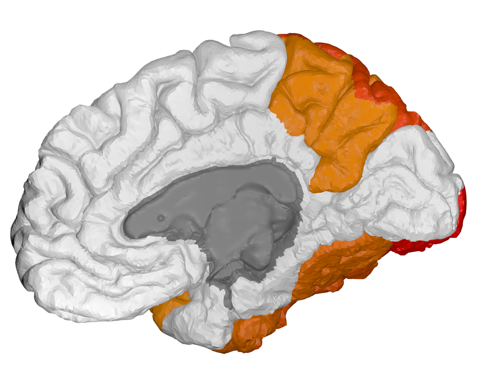

# BrainPainter - Brain colouring software 

## INPUT: 
#### csv file with biomarkers (i.e. numbers) for each brain region, in a user-defined range (0-3 here) 

Biomarker data |  hippocampus [0-3] | inferior temporal [0-3] | superior parietal [0-3] | ...
:-------------:|:-----:|:---:|:---:|:---:|
Image 1| 0.6 | 2.3 | 1.3 | ..
Image 2| 1.2 | 0.0 | 3.0 | ..
Image 3| 2.4 | 0.1 | 1.6 | ..


## OUTPUT: 
#### cortical + subcortical drawings for each table row:

Cortical - front   | Cortical - back   |  Subcortical
:-------------------------:|:------------------:|:-----------------:
 |    |   


Author: Razvan V. Marinescu - razvan@csail.mit.edu

BrainPainter is a software for colouring brain images using any used-defined input. For each brain region it takes values from a 0-1 (or 0-max), and colours the brain regions according to these numbers. Numbers could represent biomarkers or absolutely anything. 

The software is easily customisable -- one can change the colour palette, the type of brain surface, image resolution, etc ... More details below. It also requires no installation, as it is already pre-installed in a docker container.


If you find the software useful, I would appreciate if you could cite it at the end of the figure caption, along these lines: ```"Fig 1. ... Drawings generated using BrainPainter [ref]."```. 

```
References:
[ref] : R. V. Marinescu, D.C. Alexander, P. Golland, "BrainPainter: A software for the visualisation of brain structures, biomarkers and associated pathological processes", arXiv preprint arXiv:1905.08627 (2019). 

@article{marinescu2019brain,
  title={BrainPainter: A software for the visualisation of brain structures, biomarkers and associated pathological processes},
  author={Marinescu, Razvan and Alexander, Daniel and Golland, Polina},
  journal={arXiv preprint arXiv:1905.08627},
  year={2019}
}
```

License: CC-BY 3.0


## Example uses of BrainPainter


*Brains used by [Young et al, Nature Comms., 2018](https://www.nature.com/articles/s41467-018-05892-0) *

&nbsp;
&nbsp;
&nbsp;
&nbsp;


*Subcortical regions used by [Wijeratne et al, Ann. Clin. Neurol., 2018](https://onlinelibrary.wiley.com/doi/full/10.1002/acn3.558)*


# Installation using Docker

In order to remove the need to install blender and it's dependencies, I made a container which has blender and this software already pre-installed and ready to run.

1. Install Docker for your current operating system. For MacOS use this link:
https://docs.docker.com/v17.12/docker-for-mac/install/#download-docker-for-mac

    Make sure you run the docker deamon after installing. To check if it installer properly, run:
    
    ``` docker info```
    
    If prompted to make an account with dockerhub, skip as you don't need one.

2. Download the docker image with the bundled blender and brain coloring software using:
     ``` docker run -it mrazvan22/brain-coloring ```
    
    The image size may be large (~1GB), so use a good connection. Note that after the download, it will automatically connect to the container. If it connected successfully, you should see the shell as follows:
    
    ``` root@e3b175e886db:/# ```

3. Go to the directory and pull the latest changes, if any:

    ``` cd /home/brain-coloring/ ```
    
    ``` git pull origin master``` (optional)
    
4. Generate the brain images using the make command (also see Makefile):
    ``` make ```
    
If successful, you should see the images in output/pcaCover being updated. 

# Installation without Docker (only for advanced users)

Note that this is harder due to the need of installing packages in the python version bundled with blender. 

1. Install blender

2. Pull the git repository: 

    ```git clone https://github.com/mrazvan22/brain-coloring```

3. Go to the directory and run the make command

    ``` cd brain-coloring/ ```

    ``` make ```

    If successful, you should see blender loading the structures and updating the images in output/pcaCover. 

4. If running on MacOS, blender might not be added to your path. In this case, run (change the path/to/blender to your installation location):

    ``` sudo /Applications/Blender/blender.app/Contents/MacOS/blender --background --python blendCreateSnapshot.py ```

5. If python libraries are missing, install them using: 

    ``` pip3 install scipy ```
    ``` pip3 install numpy ```

    If the same error is obtained even after installing, it's probably because the packages are installed in the default system-wide python instead of the local python. See this answer for how to fix this:
    
    https://blender.stackexchange.com/questions/5287/using-3rd-party-python-modules
    
    Note: do not install the bpy package, as it comes automatically with the blender-bundled python

# Running the software

1. Generate the list of pathology numbers according to the format in data/pcaCover.csv. Each row will generate a pair of cortical/subcortical images.

2. If using docker, copy your input.csv representing pathology values to the docker container:

	``` sudo docker cp input.csv 9f52258c25f6:/home/brain-coloring/data ```
	
    Here, replace 9f52258c25f6 with your container-ID, which you can find by running ``` docker ps ``` on host:
    
	``` 
	CONTAINER ID        IMAGE                      COMMAND     
	9f52258c25f6        mrazvan22/brain-coloring   "/bin/bash"
	```


3. change configuration file config.py
	- input file: set to your new input file
	- brain type: pial or inflated
	- image type: cortical-front, cortical-back or subcortical
	- RGB colours to show pathology
	- the mapping between your atlas and the 3D brain regions that will be coloured (we use the DK atlas)
	- image resolution, etc ...
	
4. re-generate images using the Makefile command
	
	``` make ```

5. If using docker, copy the image out of the docker container to the home directory ~/ :

    ``` sudo docker cp <yourContainerID>:/home/brain-coloring/output/pcaCover/cortical_0.png ~/ ```

