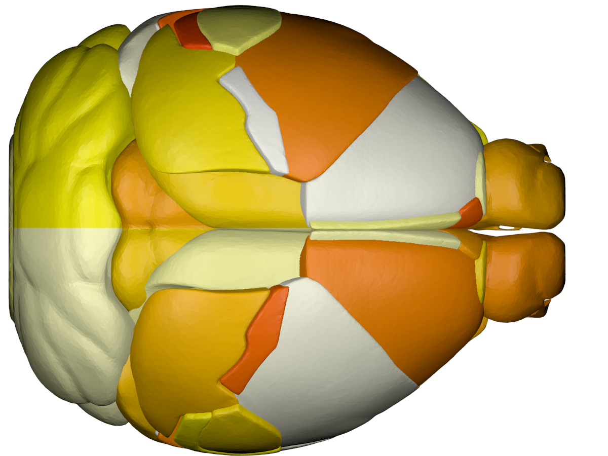

Cortical - outer   | Cortical - inner   |  Subcortical
:-------------------------:|:------------------:|:-----------------:
 |    |   

*Animation created using BrainPainter, by [Garbarino and Lorenzi, IPMI, 2019](https://arxiv.org/pdf/1901.10545.pdf) *

&nbsp;
&nbsp;
&nbsp;
&nbsp;
&nbsp;


# BrainPainter - Brain colouring software 

<span style="color:red">Jan 2023: The BrainPainter online service has now been moved to Goole Colab:</span> https://colab.research.google.com/drive/1qazM2eKGj18eXmu_IVH8HaAWyR9c8IY5#scrollTo=BPmGtEN6zI7O. The Virtual Machine at MIT CSAIL will be discontinued due to the difficulty maintaining it. 


## News

* March 2021: Mouse BrainPainter ready. To run, see the [Running Mouse BrainPainter](#Running-Mouse-BrainPainter) section.

* Oct 2020: BrainPainter v2 released. It can now color both hemispheres separately, can now show top/bottom views, abd can generate the colorbar in the report.tex/pdf in the zip file. 

* Sept 2019: Our [paper](https://arxiv.org/abs/1905.08627) describing BrainPainter has been invited for an oral presentation at the MICCAI 2019 MBIA workshop in Shenzhen, China.

* Aug 2019: In addition to the DK atlas, we now support two more atlases: Destrieux and Trouville. We also support inflated and white-matter surfaces.

## Project Contributors

We are looking for contributors to develop the project further! Please email me (razvan at csail.mit.edu) to discuss potential ideas. We are open to any interesting future directions, including:
* visualising other anatomical organs (e.g. heart, liver, ...)
* visualising white-matter tracts in the brain
* visualising toxic proteins present in the brain (e.g. amyloid, tau, ...)
* creating better movies/animations of disease progression
* any other ideas you might think is worth pursuing

## INPUT: 
#### csv file with biomarkers (i.e. numbers) for each brain region, in a user-defined range (0-3 here): 0 - white, 1 - orange, 2 - light red 3 - dark red (colours can be changed)
Biomarker data |  hippocampus [0-3] | inferior temporal [0-3] | superior parietal [0-3] | ...
:-------------:|:-----:|:---:|:---:|:---:|
Image 1| 0.6 | 2.3 | 1.3 | ..
Image 2| 1.2 | 0.0 | 3.0 | ..
Image 3| 2.4 | 0.1 | 1.6 | ..


## OUTPUT: 
#### cortical + subcortical drawings for each table row -- each region is coloured according to the numbers above:

Cortical - outer   | Cortical - inner   |  Subcortical
:-------------------------:|:------------------:|:-----------------:
 |    |   


Author: Razvan V. Marinescu - razvan@csail.mit.edu

BrainPainter is a software for colouring brain images using any used-defined input. For each brain region it takes values from a 0-1 (or 0-max), and colours the brain regions according to these numbers. Numbers could represent biomarkers or absolutely anything. 

The software is easily customisable -- one can change the colour palette, the type of brain surface, image resolution, etc ... More details below. It also requires no installation, as it is already pre-installed in a docker container.


If you find the software useful, I would appreciate if you could cite it at the end of the figure caption, along these lines: ```"Fig 1. ... Drawings generated using BrainPainter [ref]."```. 

```
References:

@article{marinescu2019brain,
  title={BrainPainter: A software for the visualisation of brain structures, biomarkers and associated pathological processes},
  author={Marinescu, Razvan and Eshaghi, Arman and Alexander, Daniel and Golland, Polina},
  journal={arXiv preprint arXiv:1905.08627},
  year={2019}
}
```

License: CC-BY 3.0


## Example uses of BrainPainter


*Brains used by [Young et al, Nature Comms., 2018](https://www.nature.com/articles/s41467-018-05892-0) *

&nbsp;
&nbsp;
&nbsp;
&nbsp;


*Subcortical regions used by [Wijeratne et al, Ann. Clin. Neurol., 2018](https://onlinelibrary.wiley.com/doi/full/10.1002/acn3.558)*


# Installation using Docker

In order to remove the need to install blender and it's dependencies, I made a container which has blender and this software already pre-installed and ready to run.

1. Install Docker for your current operating system. For MacOS use this link:
https://docs.docker.com/v17.12/docker-for-mac/install/#download-docker-for-mac

    Make sure you run the docker deamon after installing. To check if it installer properly, run:
    
    ``` sudo docker info```
    
    If prompted to make an account with dockerhub, skip as you don't need one.

2. Download the docker image with the bundled blender and brain coloring software using:
     ``` sudo docker run -it mrazvan22/brain-coloring ```
    
    The image size may be large (~1GB), so use a good connection. Note that after the download, it will automatically connect to the container. If it connected successfully, you should see the shell as follows:
    
    ``` root@e3b175e886db:/# ```

3. Go to the directory and pull the latest changes, if any:

    ``` cd /home/brain-coloring/ ```
    
    ``` git pull origin master``` (update to latest changes, if any)
    
4. Generate the brain images using the make command (also see Makefile):

    ``` make ```
    
If successful, you should see the images in folder output/DK_output/ being updated. For configuring a new experiment, see section "Running the Software" below. 
A LaTeX file will also be generated in the same folder and will load the images, names and a colorbar. 

# Installation without Docker (only for advanced users)

[This](https://www.youtube.com/watch?v=rzGb40PUVX8) video can help walk you through the installation process. 

Note that this is harder due to the need of installing packages in the python version bundled with blender. 

1. Install blender 2.79 from https://www.blender.org/download/releases/2-79/

You can also download blender 2.79 with all the necessary packages installed into the blender version of python at the following links:

a. You can find the Ubuntu/Deb version [here](https://drive.google.com/file/d/1BR1gf56VQCHrFTRAAbLm00qZ_-NceAAD/view?usp=share_link)

b. You can find the MacOS version [here](https://drive.google.com/file/d/1OBI6t5OvetllQ4USh2mMNW2Jbq1pboyX/view)

c. You can find the Windows version [here](https://drive.google.com/file/d/1tYki59PnxvQFvCScNkDSctYsdmwJrT4Z/view)

2. Pull the git repository: 

    ```git clone https://github.com/mrazvan22/brain-coloring```

3. Go to the directory and run the make command

    ``` cd brain-coloring/ ```

    ``` make ```

    If successful, you should see blender loading the structures and updating the images in output/DK_output. 

4. If running on MacOS, blender might not be added to your path. In this case, run (change the path/to/blender to your installation location):

    ``` sudo /Applications/Blender/blender.app/Contents/MacOS/blender --background --python blendCreateSnapshot.py ```

5. If python libraries are missing, install them using: 

    ``` pip3 install scipy ```
    ``` pip3 install numpy ```

    If the same error is obtained even after installing, it's probably because the packages are installed in the default system-wide python instead of the local python. See this answer for how to fix this:
    
    https://blender.stackexchange.com/questions/5287/using-3rd-party-python-modules
    
    Note: do not install the bpy package, as it comes automatically with the blender-bundled python

# Running the software

1. Create a new DK_myexperiment.csv file with pathology numbers according to the format in input/DK_template.csv (or any of the other templates there). Each row will generate a pair of cortical/subcortical images.

2. If using docker, copy your DK_myexperiment.csv to the docker container:

	``` sudo docker cp DK_myexperiment.csv 9f52258c25f6:/home/brain-coloring/input ```
	
    Here, replace 9f52258c25f6 with your container-ID, which you can find by running ``` docker ps ``` on host:
    
	``` 
	CONTAINER ID        IMAGE                      COMMAND     
	9f52258c25f6        mrazvan22/brain-coloring   "/bin/bash"
	```


3. change configuration file config.py:
	- input file: set to your new input file, input/DK_myexperiment.csv
    - input folder: set to your new output folder, e.g. output/DK_myexperiment
	- brain type: pial, inflated or white (white-matter)
	- image type: cortical-outer, cortical-inner or subcortical
	- RGB colours to show pathology
	- the mapping between your atlas and the 3D brain regions that will be coloured (we use the DK atlas)
	- image resolution, etc ...
	
4. re-generate images using the Makefile command
	
	``` make ```

5. If using docker, copy the image out of the docker container to the home directory ~/ :

    ``` sudo docker cp <yourContainerID>:/home/brain-coloring/output/DK_output/Image_1_cortical-outer.png ~/ ```

# Generating animations

Using the csv2movie script, you can span your data over multiple points and generate multiple frames for their images. This makes it easier to show pathologies in movies. This script takes the differences between the data points in your input and splits them up into more frames. 

1. Add information to the csv2movie file including: input csv data, output csv location, atlas

2. Run the script (make sure you have numpy and pandas in your virtual environment)
   
   ``` python ./csv2movie.py ```

3. Follow the instructions in the [Running the software](#Running-the-software) section and make sure to change the input data in your config file to the new movie template that was generated. 

4. Use imagemagick to stitch together these multiple frames into a gif. If you prefer to use an online version, [this](https://ezgif.com/maker) can help you generate gif's and mp4's easily. 
# Running Mouse BrainPainter

Cortical - outer    | Top   |  Subcortical
:-------------------------:|:------------------:|:-----------------:
 |    |   

1. Create a new mouse_experiment.csv file with pathology data using the template found at input/mouse_template.csv. 

2. Make sure to set the ATLAS in the config.py file to 'Mice'

3. Run the same steps in the [Running the software](#Running-the-software) section to generate images

# Frequently Asked Questions

* ***I'm getting an error when I call the make command:***

```/bin/sh: 1: blender: not found```

This means that the Blender software is not in your path. You can replace "blender" in the Makefile with the path to your blender application if that's more convenient instead of adding blender to path. 

* ***How do I generate animations with BrainPainter***

Check out our section on [generating animations](#Generating-Animations)

* ***What are the different viewing angles that we can render images with?***

1. Cortical-Top
2. Cortical-Bottom
3. Cortical-outer-right-hemisphere
4. Cortical-outer-left-hemisphere
5. Cortical-inner-right-hemisphere (note that this is not compatible with the mouse atlas)
6. Cortical-inner-left-hemisphere (note that this is not compatible with the mouse atlas)
7. subcortical-top
8. subcortical-bottom
9. subcortical-outer-right-hemisphere
10. subcortical-outer-left-hemisphere

Have a viewing angle in mind that isn't here? You can run blender interactively by removing '--background' from the makefile and render the images from the blender app. You can also open an *issue* on this github page. 

* ***We will keep adding questions to this list, so if you have one in mind feel free to make an issue and we will add it here.*** 


